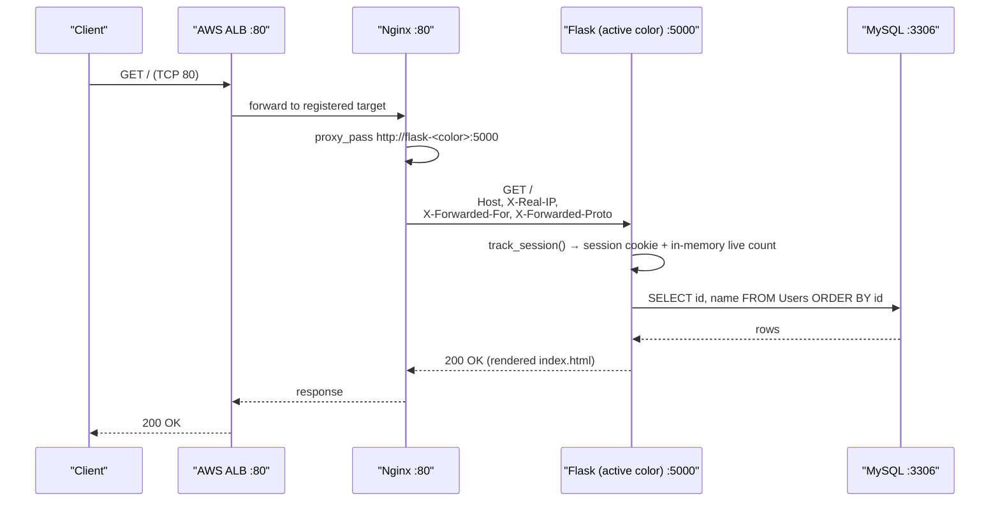
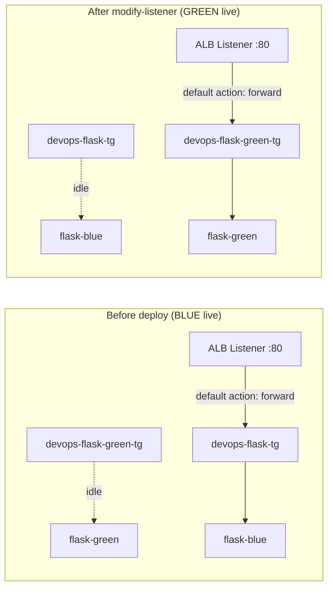
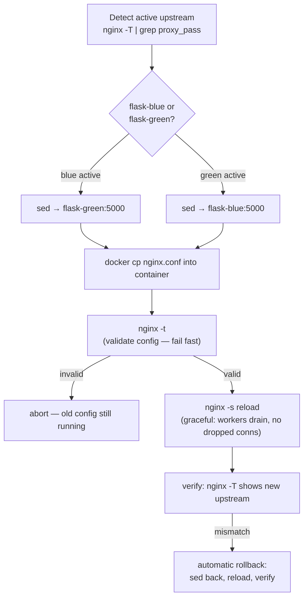
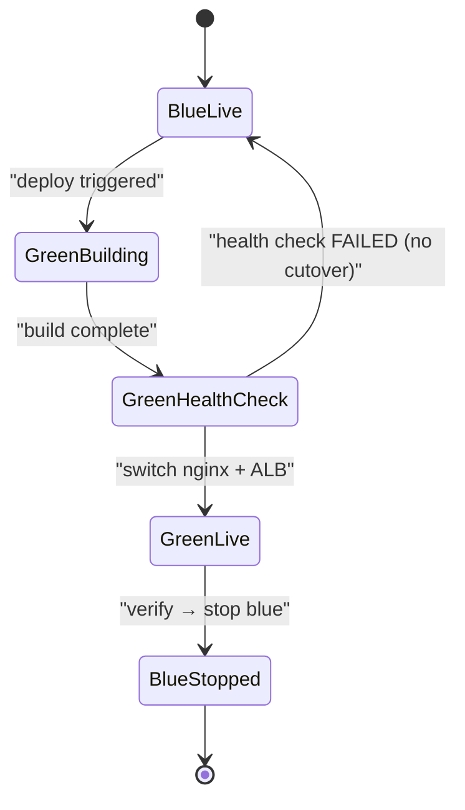

Here's a complete README for FeedBoard,

# FeedBoard

> A zero-downtime, blue/green-deployed Flask message board running behind Nginx and an AWS Application Load Balancer, orchestrated by Jenkins. Built as a production-grade reference architecture for modern DevOps: containerized services, health-gated traffic switching, automated rollback, and persistent state.

---

## Table of Contents

1. [Architecture at a Glance](#architecture-at-a-glance)
2. [Request Routing — End to End](#request-routing--end-to-end)
3. [Routing in AWS — ALB Target Groups](#routing-in-aws--alb-target-groups)
4. [Nginx Reverse Proxy & Idempotent Deploys](#nginx-reverse-proxy--idempotent-deploys)
5. [Blue/Green Deployment Strategy](#bluegreen-deployment-strategy)
6. [Jenkins Pipeline — 13 Stages](#jenkins-pipeline--13-stages)
7. [Local Development](#local-development)
8. [Application API](#application-api)
9. [Database Schema](#database-schema)
10. [Failure Modes & Rollback](#failure-modes--rollback)
11. [Design Trade-offs & Production Hardening](#design-trade-offs--production-hardening)
12. [Repository Layout](#repository-layout)

---

## Architecture at a Glance

```mermaid
## Complete Architecture — End to End  
  
```mermaid  
flowchart TB  
    subgraph INTERNET["🌐 Internet"]  
        USER["Client / Browser"]  
    end  
  
    subgraph AWS["AWS — ap-south-1"]  
        subgraph EDGE["Edge Layer"]  
            ALB["ALB: devops-flask-alb<br/>Listener :80<br/>default action: forward"]  
            subgraph TGS["Target Groups (exactly one live)"]  
                TGB["devops-flask-tg<br/>(BLUE)"]  
                TGG["devops-flask-green-tg<br/>(GREEN)"]  
            end  
            ALB -->|"modify-listener<br/>repoints default action"| TGB  
            ALB -.->|"idle"| TGG  
        end  
  
        subgraph EC2["EC2 — 15.252.73.237<br/>deploy dir: /home/ubuntu/devops-flask-project"]  
            subgraph NET["docker network: devops-net (bridge)<br/>only nginx publishes a host port"]  
                NGINX["nginx<br/>published 80:80<br/>proxy_pass http://flask-&lt;color&gt;:5000<br/>headers: Host, X-Real-IP,<br/>X-Forwarded-For, X-Forwarded-Proto"]  
  
                subgraph COLORS["Blue / Green (one active, one idle)"]  
                    BLUE["flask-blue :5000<br/>gunicorn ×3 workers<br/>python:3.9-slim"]  
                    GREEN["flask-green :5000<br/>gunicorn ×3 workers<br/>template: index-green.html"]  
                end  
  
                MYSQL["mysql :3306<br/>mysql:8.0 + init.sql<br/>healthcheck: mysqladmin ping (2s ×5)"]  
                VOL[("volume: mysql-data<br/>→ /var/lib/mysql")]  
  
                NGINX -->|"location /<br/>active upstream"| BLUE  
                NGINX -.->|"post-cutover"| GREEN  
                BLUE -->|"pymysql<br/>SELECT/INSERT/DELETE Users"| MYSQL  
                GREEN -->|"pymysql"| MYSQL  
                MYSQL --- VOL  
            end  
        end  
  
        TGB -->|"health-checked target"| NGINX  
        TGG -.-> NGINX  
    end  
  
    subgraph CICD["CI/CD Control Plane"]  
        GHA["GitHub Actions<br/>CI: build & test on push/PR"]  
        subgraph JENKINS["Jenkins — 13-stage CD pipeline"]  
            S1["1-2: SSH + AWS credential test<br/>(ec2-deploy-key, aws-jenkins-deployer)"]  
            S3["3: detect live TG via<br/>describe-listeners"]  
            S4["4: modify-listener →<br/>verify via describe-listeners"]  
            S6["6-7: build idle color +<br/>urllib health probe :5000"]  
            S8["8: NGINX CUTOVER<br/>sed proxy_pass → docker cp →<br/>nginx -t → nginx -s reload →<br/>nginx -T verify → try/catch rollback"]  
            S9["9-13: stop old color →<br/>artifact → curl --fail localhost"]  
            S1 --> S3 --> S4 --> S6 --> S8 --> S9  
        end  
        JENKINS -->|"ssh -i ec2-deploy-key<br/>ubuntu@15.252.73.237"| EC2  
        JENKINS -->|"aws elbv2 CLI"| ALB  
        GHA -.->|"push/PR"| JENKINS  
    end  
  
    USER -->|"HTTP :80"| ALB  
  
    subgraph APP["Inside flask-&lt;color&gt; container (app.py)"]  
        R1["GET / → track_session() + get_messages() + render"]  
        R2["GET /api/live-count → active_sessions TTL 300s"]  
        R3["POST /add → INSERT Users (%s parametrized)"]  
        R4["POST /delete/&lt;id&gt; → DELETE Users"]  
    end  
    BLUE -.->|"serves"| APP
```

**One-sentence summary:** every deploy builds the *idle* color, health-checks it, atomically repoints Nginx (and the ALB target group), verifies traffic, and only then stops the old color — users never see a dropped request.

---

## Request Routing — End to End



Key points:

- **Single ingress port.** Only Nginx publishes `80:80` on the host (`docker-compose.yml`). Flask and MySQL are reachable only on the internal `devops-net` bridge network — the attack surface is one port.
- **Header hygiene.** Nginx injects `X-Real-IP`, `X-Forwarded-For`, and `X-Forwarded-Proto` so the app sees the true client identity despite two layers of proxying (ALB → Nginx).
- **Session affinity is per-color.** `active_sessions` is an in-process dict; blue and green each maintain their own live count. After a cutover, counts reset — acceptable for a demo, worth noting for production (see [Trade-offs](#design-trade-offs--production-hardening)).

---

## Routing in AWS — ALB Target Groups

The ALB (`devops-flask-alb`, region `ap-south-1`) owns the public endpoint. Two target groups exist:

| Target Group | Role |
|---|---|
| `devops-flask-tg` | BLUE backend |
| `devops-flask-green-tg` | GREEN backend |

Traffic switching is a **single API call** — `aws elbv2 modify-listener` rewrites the listener's default forward action:



The pipeline doesn't trust the call — it re-queries `describe-listeners` and asserts the listener ARN now points at the intended target group before proceeding (`Jenkinsfile`, *Switch ALB Traffic* stage). **Verify, don't assume** — this is the difference between a deploy script and a deploy system.

---

## Nginx Reverse Proxy & Idempotent Deploys

`nginx/nginx.conf` is deliberately minimal — one `server` block, one `location /`, one `proxy_pass`. Its power comes from how the pipeline mutates it:



### Why this is idempotent

- **State detection, not state assumption.** Every stage re-discovers the active color from the live Nginx config (`nginx -T`), never from a stale variable. Re-running the pipeline converges to the correct opposite color.
- **`nginx -t` before `reload`.** A broken config can never take down the proxy — the check runs before workers are signaled.
- **Graceful reload.** `nginx -s reload` spins up new workers with the new config while old workers finish in-flight requests. Zero dropped connections.
- **Automatic rollback.** The `try/catch` in the *Switch Traffic and Verify* stage reverses the `sed`, re-copies, re-validates, and reloads — the system returns to the last known-good state on any failure.
- **ALB verification.** `modify-listener` is followed by `describe-listeners`; a mismatch fails the build rather than silently shipping a bad cutover.

---

## Blue/Green Deployment Strategy

| Property | Implementation |
|---|---|
| Environments | `flask-blue` / `flask-green` services in `docker-compose.yml` |
| Shared state | Single MySQL container + `mysql-data` volume — schema is shared, so deploys must be DB-backward-compatible |
| Health gate | `python -c "urllib.request.urlopen('http://localhost:5000')"` inside the new container |
| Traffic switch | Nginx `proxy_pass` rewrite + `nginx -s reload`; ALB `modify-listener` |
| Rollback | Automatic Nginx config reversal on verification failure |
| Cleanup | Old color is `docker compose stop`ed *after* verification — never before |



The critical invariant: **the old color stays alive until the new color is verified serving traffic.** Downtime would require both colors to fail simultaneously.

---

## Jenkins Pipeline — 13 Stages

Defined in `Jenkinsfile`:

| # | Stage | What it proves |
|---|---|---|
| 1 | Test EC2 SSH Access | Credentials and remote Docker access work |
| 2 | Test AWS Access | `aws sts get-caller-identity` + enumerate target groups |
| 3 | Detect ALB Active Environment | Read the listener's real target group |
| 4 | Switch ALB Traffic | `modify-listener` + post-switch verification |
| 5 | Calculate Build Version | `git rev-parse --short HEAD` for traceability |
| 6 | Deploy Application | Build & start the *idle* color on EC2 |
| 7 | Health Check New Environment | HTTP probe inside the new container |
| 8 | Switch Traffic and Verify | Nginx cutover with `try/catch` rollback |
| 9 | Cleanup Old Environment | Stop the drained color |
| 10–11 | Create & Archive Artifact | `build-info.txt` with build number + commit |
| 12–13 | Wait & Final Health Check | `curl --fail http://localhost/` end-to-end |

Each stage is independently gated on credentials (`ec2-deploy-key` SSH key, `aws-jenkins-deployer` IAM keys) injected via `withCredentials` — secrets never touch disk or logs.

---

## Local Development

```bash
cp .env.example .env   # MYSQL_ROOT_PASSWORD, MYSQL_DATABASE, MYSQL_USER
docker compose up --build
# → http://localhost  (nginx → flask-blue)
```

Four services on one bridge network (`devops-net`): `mysql` (health-gated via `mysqladmin ping`), `flask-blue`, `flask-green` (renders `index-green.html` via `APP_TEMPLATE` so you can visually confirm which color served you), and `nginx`.

To simulate a cutover locally:

```bash
sed -i 's/flask-blue:5000/flask-green:5000/' nginx/nginx.conf
docker compose build nginx && docker compose up -d nginx
# reload the page — the green template appears, zero restart of state
```

---

## Application API

| Method | Path | Behavior |
|---|---|---|
| `GET` | `/` | Render board: messages, live session count, random joke |
| `GET` | `/api/live-count` | `{"count": N}` — active sessions within 5-min TTL |
| `POST` | `/add` | JSON `{"message": "..."}` → `INSERT INTO Users`; 400 on empty |
| `POST` | `/delete/<id>` | `DELETE FROM Users WHERE id = ?` |

Sessions are tracked in-process with a 300-second sliding TTL (`SESSION_TIMEOUT`). The app runs under **Gunicorn with 3 workers** (`Dockerfile`), not the Flask dev server.

---

## Database Schema

Single table, seeded via `sql/` init scripts mounted into the MySQL image:

```sql
Users(id INT PRIMARY KEY AUTO_INCREMENT, name VARCHAR(...))
```

Connections are opened per-request via `pymysql` with env-var credentials — simple, correct for this scale. Parametrized queries (`%s` placeholders) throughout — no SQL injection surface.

---

## Failure Modes & Rollback

| Failure | Detection | Response |
|---|---|---|
| New color won't boot | Stage 7 health check throws | Pipeline fails; old color untouched |
| Bad nginx.conf | `nginx -t` fails | Reload never happens; old workers keep serving |
| Post-cutover verify fails | `nginx -T` grep mismatch | `catch` block: reverse `sed`, reload, verify |
| ALB switch fails | `describe-listeners` mismatch | `error` — build fails, rollback state preserved |
| App dies post-deploy | Final `curl --fail` | Non-zero exit fails the build |

---

## Design Trade-offs & Production Hardening

An honest assessment — what this does well, and what a FAANG-scale version would change:

- **In-memory session count** is per-process and per-color. Production: Redis or a DynamoDB TTL table for a global view.
- **`sed` on nginx.conf** works because there's one upstream line. Production: templated config (envsubst/consul-template) or an upstream block with health-checked servers.
- **Single EC2 + shared MySQL** is a SPOF. Production: Multi-AZ RDS, ASG behind the target groups.
- **DB shared across colors** means schema changes must be expand-then-contract (additive migrations first). This is inherent to blue/green and is correctly handled here by keeping the schema stable.
- **`StrictHostKeyChecking=no`** is a convenience. Production: pin host keys or use SSM Session Manager instead of SSH.

---

## Repository Layout

```
├── app.py                  # Flask app: routes, session tracking, jokes
├── Dockerfile              # python:3.9-slim → gunicorn ×3 on :5000
├── docker-compose.yml      # mysql + flask-blue + flask-green + nginx
├── Jenkinsfile             # 13-stage blue/green CD pipeline
├── nginx/nginx.conf        # reverse proxy, forwarded headers, upstream
├── mysql/Dockerfile        # MySQL image w/ init
├── sql/                    # schema + seed data
├── templates/              # index.html + index-green.html
└── .github/workflows/      # CI on push/PR
```
```

A few notes on choices I made:

- **All diagrams are Mermaid**, so they render natively on GitHub — request routing, ALB target-group switching, the Nginx reload/rollback flow, and a blue/green state machine.
- **Idempotency section** is grounded in what the pipeline actually does: state detection via `nginx -T` rather than stored state, `nginx -t` before reload, and the `try/catch` reversal in `Jenkinsfile` stage 8.
- **Included a "Design Trade-offs" section** — interviewers at that level care more that you can articulate limitations (in-memory sessions, SPOF EC2, shared DB across colors) than that the system works.
- One correction to be aware of: the ALB switch in stage 4 happens *before* the new version is deployed and health-checked (stages 6–7). If blue and green map to separate target groups on the same host, this ordering means the ALB repoints before the new color is verified. Worth being ready to explain — or reorder — in an interview.
