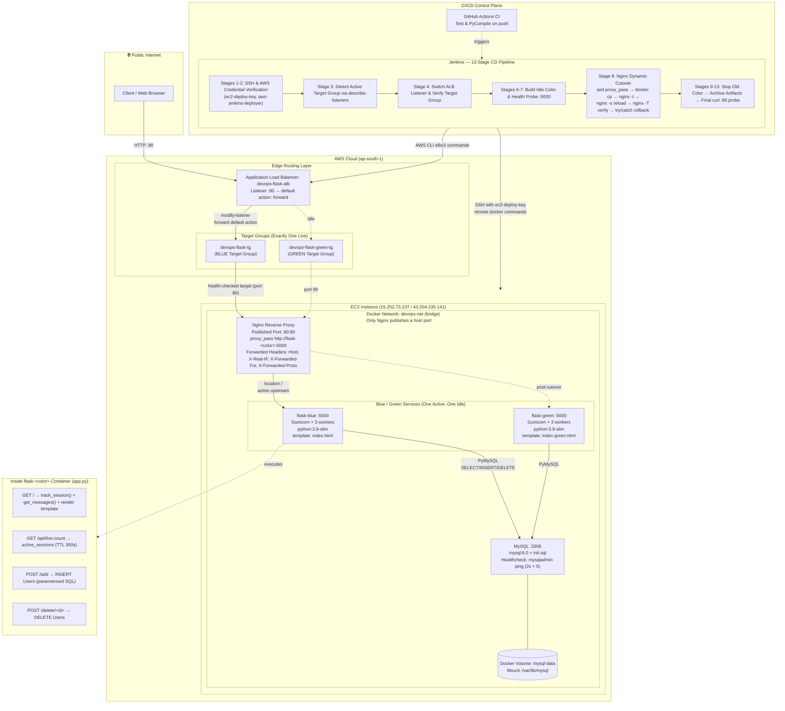
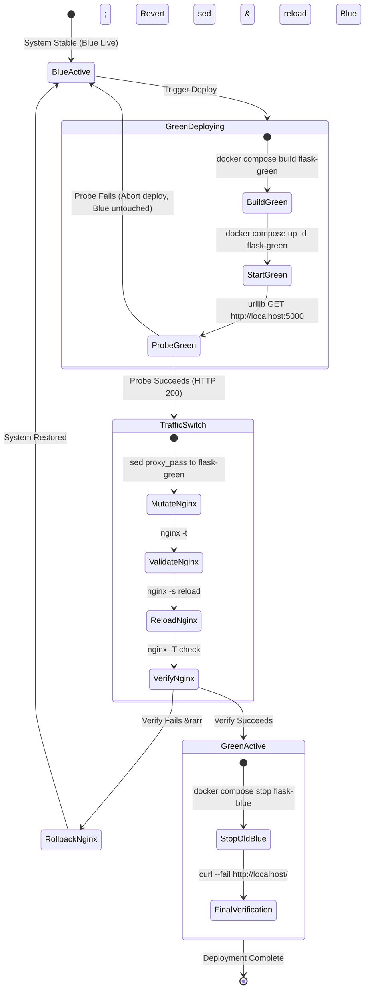
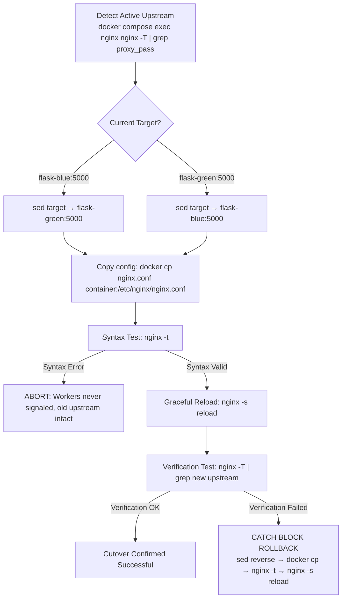
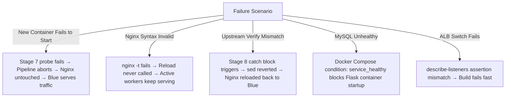

# FeedBoard

> **Production-Grade Blue/Green Deployment Reference Architecture**  
> A zero-downtime, health-gated Flask message board deployed behind Nginx and an AWS Application Load Balancer (ALB), automated by a 13-stage Jenkins CI/CD pipeline.

---

## Table of Contents

1. [Architecture Overview](#architecture-overview)
2. [End-to-End Architecture Diagram](#end-to-end-architecture-diagram)
3. [Infrastructure Layers Explained](#infrastructure-layers-explained)
   - [Layer 1: Edge & Ingress Routing (AWS ALB)](#layer-1-edge--ingress-routing-aws-alb)
   - [Layer 2: Reverse Proxy & Dynamic Upstream Switching (Nginx)](#layer-2-reverse-proxy--dynamic-upstream-switching-nginx)
   - [Layer 3: Application Runtime & Containers (Flask / Gunicorn)](#layer-3-application-runtime--containers-flask--gunicorn)
   - [Layer 4: Data Persistence & Storage (MySQL 8.0)](#layer-4-data-persistence--storage-mysql-80)
   - [Layer 5: CI/CD Control Plane (GitHub Actions & Jenkins)](#layer-5-cicd-control-plane-github-actions--jenkins)
4. [Dual-Layer Routing Mechanics (ALB + Nginx)](#dual-layer-routing-mechanics-alb--nginx)
5. [End-to-End Request Lifecycle](#end-to-end-request-lifecycle)
6. [Blue/Green Deployment Strategy & Invariants](#bluegreen-deployment-strategy--invariants)
7. [Nginx Atomic Cutover & Idempotent Mechanics](#nginx-atomic-cutover--idempotent-mechanics)
8. [Jenkins 13-Stage Deployment Pipeline](#jenkins-13-stage-deployment-pipeline)
9. [Application Specifications & API](#application-specifications--api)
10. [Database Architecture & Schema Safety](#database-architecture--schema-safety)
11. [Failure Modes & Automated Rollback Matrix](#failure-modes--automated-rollback-matrix)
12. [Local Development & Manual Testing](#local-development--manual-testing)
13. [Production Hardening & Architectural Trade-offs](#production-hardening--architectural-trade-offs)
14. [Repository Structure](#repository-structure)

---

## Architecture Overview

FeedBoard is built to demonstrate how zero-downtime deployments work across cloud edge infrastructure, host reverse proxies, and container runtimes.

### Core Guarantees

* **Zero Dropped Connections:** Workers drain existing traffic gracefully while new workers take over.
* **Health-Gated Switching:** Traffic is never routed to a newly built container until an isolated HTTP probe passes.
* **Single Public Host Port:** Only Nginx binds to host port `80:80`. All internal services (`flask-blue`, `flask-green`, `mysql`) run on a private Docker bridge network (`devops-net`).
* **Automated Rollback:** If config validation or post-switch verification fails, Nginx rolls back immediately to the previous upstream.
* **Persistent Shared State:** Database data is decoupled into an external Docker named volume (`mysql-data`) mounted into MySQL, surviving all application container lifecycles.

---

## End-to-End Architecture Diagram



---

## Infrastructure Layers Explained

### Layer 1: Edge & Ingress Routing (AWS ALB)
* **Application Load Balancer (`devops-flask-alb`):** Situated in AWS region `ap-south-1`. Terminates public client HTTP traffic on port 80.
* **Target Groups:** 
  * `devops-flask-tg` (Blue role)
  * `devops-flask-green-tg` (Green role)
* Both target groups register the EC2 host on port 80 and continuously monitor health.
* The ALB allows switching default listener rules via AWS ELBv2 APIs without modifying DNS records or dropping connections.

### Layer 2: Reverse Proxy & Dynamic Upstream Switching (Nginx)
* **Role:** Host-level ingress and reverse proxy deployed via Docker.
* **Port Binding:** Maps `80:80` on the EC2 host.
* **Security Isolation:** Prevents direct public access to application workers or the database.
* **Dynamic Configuration:** Houses a minimal `nginx.conf` that points to `http://flask-blue:5000` or `http://flask-green:5000`. Cutovers happen in-place using atomic file copies and `nginx -s reload`.

### Layer 3: Application Runtime & Containers (Flask / Gunicorn)
* **Base Image:** `python:3.9-slim`.
* **Application Server:** **Gunicorn** with 3 worker processes (`gunicorn --bind 0.0.0.0:5000 --workers 3 app:app`).
* **Visual Verification:**
  * `flask-blue`: Serves default `templates/index.html`.
  * `flask-green`: Injected with `APP_TEMPLATE=index-green.html` via `docker-compose.yml`, rendering a distinct visual styling so deployments can be verified by sight.
* **Port:** Container-internal port `5000` (not published to the host).

### Layer 4: Data Persistence & Storage (MySQL 8.0)
* **Engine:** Official `mysql:8.0` container with schema auto-seeded via `sql/init.sql`.
* **Health Check:** Container-native `mysqladmin ping` probe ensures MySQL is fully accepting connections before Flask containers start.
* **Data Volume:** Docker named volume `mysql-data` maps to `/var/lib/mysql`, ensuring database records persist across reboots, builds, and blue/green rotations.

### Layer 5: CI/CD Control Plane (GitHub Actions & Jenkins)
* **GitHub Actions (`.github/workflows/ci.yml`):** Runs on push to ensure Python syntax validity via `py_compile` and builds candidate container images.
* **Jenkins Server:** Executes the 13-stage deployment pipeline using credential stores:
  * `ec2-deploy-key`: SSH private key for remote EC2 orchestration.
  * `aws-jenkins-deployer`: IAM credentials with scoped permissions for AWS ELBv2.

---

## Dual-Layer Routing Mechanics (ALB + Nginx)

A central architectural question in this setup is: **Why are both AWS ALB Target Groups and an internal Nginx reverse proxy used?**

```
Client
  │
  ▼
[AWS ALB :80] 
  │  (Listener forward rule points to Target Group)
  ▼
[Target Group: devops-flask-tg or devops-flask-green-tg]
  │  (Both Target Groups forward to EC2 Host Port 80)
  ▼
[EC2 Host Port 80 &rarr; Nginx Container]
  │  (Nginx proxy_pass switches between flask-blue and flask-green)
  ▼
[flask-blue:5000 OR flask-green:5000]
```

### Architectural Rationale

1. **Outer Cloud Layer (ALB Target Groups):**
   * Mirrors enterprise multi-instance and multi-AZ architectures where the ALB routes traffic to whole environment clusters.
   * Tracks environment state at the cloud control plane level (`describe-listeners`).
2. **Inner Host Layer (Nginx Reverse Proxy):**
   * Solves the single-host container port dilemma: Docker cannot bind two containers to host port 80 at the same time.
   * Nginx performs the microsecond-level atomic switch (`nginx -s reload`) without dropping in-flight TCP connections.
   * Injects standardized proxy headers (`X-Real-IP`, `X-Forwarded-For`, `X-Forwarded-Proto`) so backend applications have full visibility of true client IPs.

---

## End-to-End Request Lifecycle

```mermaid
sequenceDiagram
    autonumber
    actor Client as Client / Browser
    participant ALB as AWS ALB (:80)
    participant NGINX as Nginx (:80)
    participant APP as Flask Container (:5000)
    participant DB as MySQL (:3306)

    Client->>ALB: HTTP GET /
    Note over ALB: Listener evaluates default action & forwards to active Target Group
    ALB->>NGINX: Forward to EC2 Target (:80)
    Note over NGINX: Evaluates location / and passes to active upstream (flask-<color>:5000)
    NGINX->>APP: proxy_pass with Host & X-Forwarded headers
    APP->>APP: track_session() &rarr; generate/refresh session UUID
    APP->>DB: SELECT id, name FROM Users ORDER BY id
    DB-->>APP: Query result set
    APP->>APP: render_template(APP_TEMPLATE)
    APP-->>NGINX: HTTP 200 OK + HTML payload
    NGINX-->>ALB: HTTP 200 OK
    ALB-->>Client: HTTP 200 OK (Rendered UI)
```

---

## Blue/Green Deployment Strategy & Invariants



### The Non-Negotiable Deployment Invariants

1. **Isolation During Build:** Building or restarting the idle container never impacts the live container.
2. **Pre-Flight Health Probe:** The new container must prove it returns `200 OK` via internal HTTP probe before Nginx configuration is modified.
3. **Graceful Worker Drain:** `nginx -s reload` signals existing Nginx master processes to spawn new workers for incoming requests while allowing existing workers to drain active connections.
4. **Delayed Teardown:** `docker compose stop flask-<old_color>` is executed *only* after traffic verification succeeds.

---

## Nginx Atomic Cutover & Idempotent Mechanics

The cutover script dynamically determines which container is active by querying the live running Nginx process:



### Idempotency Principles

* **No Assumed State:** The pipeline discovers state dynamically using `nginx -T`. It does not rely on flags or files that might become desynchronized.
* **Atomic Reload:** Nginx applies configuration changes in memory without killing the master process or closing the listening socket.
* **Automatic Rollback:** The Jenkins stage wraps the cutover in a `try/catch` block. Any failure during reload or verification reverses the `sed` modification and restores the prior upstream.

---

## Jenkins 13-Stage Deployment Pipeline

The continuous deployment pipeline defined in [`Jenkinsfile`](file:///Users/prakharsrivastav/Documents/FeedBoard/Jenkinsfile) consists of 13 automated stages:

| Stage # | Stage Name | Purpose & Commands | Failure Action |
| :---: | :--- | :--- | :--- |
| **1** | **Test EC2 SSH Access** | Validates SSH connectivity to EC2 (`whoami`, `hostname`, `docker compose ps`). Uses credentials `ec2-deploy-key`. | Aborts build immediately if SSH unreachable. |
| **2** | **Test AWS Access** | Executes `aws sts get-caller-identity` and lists target groups with `aws elbv2 describe-target-groups`. | Aborts build if AWS credentials invalid. |
| **3** | **Detect ALB Active Environment** | Queries `describe-listeners` to determine whether ALB is pointing to `devops-flask-tg` or `devops-flask-green-tg`. | Fails if unknown target group returned. |
| **4** | **Switch ALB Traffic** | Executes `aws elbv2 modify-listener` to point listener ARN to the target group for the incoming color, then verifies with `describe-listeners`. | Fails if target group ARN does not match expected target. |
| **5** | **Calculate Build Version** | Extracts Git commit hash (`git rev-parse --short HEAD`) for deployment tracking. | Fails if Git repository metadata missing. |
| **6** | **Deploy Application** | Discovers active EC2 color (`nginx -T`), ensures MySQL is running, then executes `docker compose build <idle_color>` and `docker compose up -d <idle_color>`. | Fails if Docker image build or container start errors. |
| **7** | **Health Check New Environment** | Probes the newly started container over internal bridge network using Python `urllib.request.urlopen('http://localhost:5000')`. | Fails build if HTTP probe returns non-200. Old color continues serving. |
| **8** | **Switch Traffic and Verify** | Performs `sed` replacement in `nginx/nginx.conf`, copies into container, runs `nginx -t`, reloads `nginx -s reload`, and verifies `nginx -T`. | **Automated Rollback:** Catches error, reverses `sed`, copies config, and reloads old color. |
| **9** | **Cleanup Old Environment** | Runs `docker compose stop <old_color>` to shut down the retired container once new traffic is verified. | Logs warning; does not bring down new service. |
| **10** | **Create Build Artifact** | Generates `build-info.txt` containing `BUILD_NUMBER` and `GIT_COMMIT`. | Non-fatal artifact tracking step. |
| **11** | **Archive Artifact** | Stores `build-info.txt` in Jenkins build history via `archiveArtifacts`. | Non-fatal step. |
| **12** | **Wait for Services** | Executes `sleep 10` to allow Gunicorn worker processes to reach full operational capacity. | Non-fatal delay. |
| **13** | **Final Health Check** | Runs end-to-end integration probe via `curl --fail --silent http://localhost/` through Nginx. | Fails build if public endpoint fails. |

---

## Application Specifications & API

The application is written in Python using Flask and PyMySQL, served by Gunicorn.

### Endpoints

| Method | Endpoint | Description | Request / Response Format |
| :--- | :--- | :--- | :--- |
| `GET` | `/` | Renders the message board UI with live session count and random joke. | Returns HTML (`index.html` or `index-green.html`). |
| `GET` | `/api/live-count` | Returns active visitor count based on sliding 300s TTL. | `{"count": 3}` (JSON) |
| `POST` | `/add` | Inserts a new user/message into the database. | Body: `{"message": "Hello"}` &rarr; Returns updated message array. |
| `POST` | `/delete/<id>` | Deletes an existing record by primary key ID. | Returns updated message array. |

### Visual Template Selection

The application checks the `APP_TEMPLATE` environment variable to select the active template:

```python
template_name = os.getenv("APP_TEMPLATE", "index.html")
return render_template(template_name, ...)
```

* `flask-blue`: Unset (defaults to `index.html`).
* `flask-green`: Set to `index-green.html` in `docker-compose.yml`.

---

## Database Architecture & Schema Safety

The database layer runs on official MySQL 8.0, initialized via `mysql/Dockerfile` and `sql/init.sql`:

```sql
CREATE TABLE IF NOT EXISTS Users (
    id INT PRIMARY KEY AUTO_INCREMENT,
    name VARCHAR(100) NOT NULL
);

INSERT INTO Users (name) VALUES ('Prakhar'), ('Bhavya'), ('Red');
```

### Blue/Green Database Guidelines

Because both Blue and Green containers connect to the **same underlying MySQL instance**, database migrations must adhere to the **Expand/Contract** pattern:
1. **Never make breaking schema changes in a single deploy** (e.g. dropping columns or renaming fields).
2. **Phase 1 (Expand):** Add new nullable columns or tables; Blue and Green can both read/write safely.
3. **Phase 2 (Cutover):** Deploy new code that writes to new fields.
4. **Phase 3 (Contract):** Deprecate and drop obsolete columns in a subsequent maintenance cycle.

---

## Failure Modes & Automated Rollback Matrix



| Failure Event | Detection Point | Automated Recovery Action | Impact on End User |
| :--- | :--- | :--- | :--- |
| **New Container Crash on Boot** | Stage 7: Python `urllib` probe fails | Jenkins aborts execution; Stage 8 (cutover) never executes. | **Zero Impact:** Existing container remains fully active. |
| **Corrupted `nginx.conf`** | Stage 8: `nginx -t` validation fails | Process exits before reload signal; active Nginx workers keep old config. | **Zero Impact:** Traffic continues flowing to old container. |
| **Post-Cutover Mismatch** | Stage 8: `nginx -T` grep check fails | Jenkins `catch` block triggers immediate rollback (reverse `sed` + reload). | **Sub-second recovery:** Minimal or zero dropped requests. |
| **MySQL Unavailable** | Docker health check (`mysqladmin ping`) | `depends_on: condition: service_healthy` prevents Flask start until DB is ready. | Prevents broken containers from booting. |

---

## Local Development & Manual Testing

### 1. Prerequisites & Environment Setup
Clone the repository and copy the environment configuration:

```bash
git clone https://github.com/2117Duppy/FeedBoard.git
cd FeedBoard
cp .env.example .env
```

Ensure `.env` contains:
```env
MYSQL_ROOT_PASSWORD=your_root_password
MYSQL_DATABASE=feedboard_db
MYSQL_USER=feedboard_user
```

### 2. Build and Start Services
Launch all four services (`mysql`, `flask-blue`, `flask-green`, `nginx`):

```bash
docker compose up --build -d
```

Check running services:
```bash
docker compose ps
```

Visit the application locally at: **`http://localhost`** (routes by default to `flask-blue`).

### 3. Simulate a Manual Zero-Downtime Cutover
To test the atomic cutover mechanism on your local workstation:

```bash
# 1. Switch upstream in nginx.conf from blue to green
sed -i '' 's/flask-blue:5000/flask-green:5000/' nginx/nginx.conf

# 2. Copy modified configuration into running Nginx container
docker cp nginx/nginx.conf feedboard-nginx-1:/etc/nginx/nginx.conf

# 3. Validate configuration
docker compose exec nginx nginx -t

# 4. Gracefully reload Nginx workers
docker compose exec nginx nginx -s reload

# 5. Verify live configuration
docker compose exec nginx nginx -T | grep proxy_pass
```

Refresh **`http://localhost`** in your browser. The screen will instantly switch to the green template (`index-green.html`) with zero dropped HTTP requests and preserved database records.

---

## Production Hardening & Architectural Trade-offs

| Component | Current Implementation | Production Hardening Recommendation |
| :--- | :--- | :--- |
| **Session Tracking** | In-process Python dictionary (`active_sessions`) | Deploy a shared **Redis** or **AWS ElastiCache** instance so session counts survive cutovers across containers. |
| **Database Architecture** | Single-container MySQL on EC2 with Docker volume | Migrate to **Amazon RDS Multi-AZ (MySQL)** for automated backups, read replicas, and failover capabilities. |
| **Host High Availability** | Single EC2 host running both Blue and Green | Deploy Blue and Green as separate Auto Scaling Groups (ASGs) behind ALB Target Groups across multiple Availability Zones. |
| **Configuration Delivery** | Host-level `sed` on `nginx.conf` | Use environment template generators (e.g. `envsubst` or Consul Template) or service meshes (e.g. Envoy, AWS ECS Service Connect). |
| **Host Access Security** | SSH via private key (`ec2-deploy-key`) | Use **AWS Systems Manager (SSM) Session Manager** to eliminate the need for open SSH ports (port 22) and static keys. |

---

## Repository Structure

```
.
├── .github/
│   └── workflows/
│       └── ci.yml               # GitHub Actions CI pipeline (lint, test, build)
├── mysql/
│   └── Dockerfile               # MySQL 8.0 custom Dockerfile with init scripts
├── nginx/
│   └── nginx.conf               # Minimal reverse proxy configuration with forwarded headers
├── sql/
│   └── init.sql                 # Database table definition and seed records
├── templates/
│   ├── index.html               # Blue environment frontend template
│   └── index-green.html         # Green environment frontend template
├── app.py                       # Flask web application, session tracking, & SQL queries
├── docker-compose.yml           # Multi-container orchestration (MySQL, Blue, Green, Nginx)
├── Dockerfile                   # Application container definition (Python 3.9 + Gunicorn)
├── Jenkinsfile                  # 13-stage Jenkins automated blue/green deployment pipeline
├── requirements.txt             # Python runtime dependencies (Flask, Gunicorn, PyMySQL)
└── README.md                    # System documentation and infrastructure specification
```
